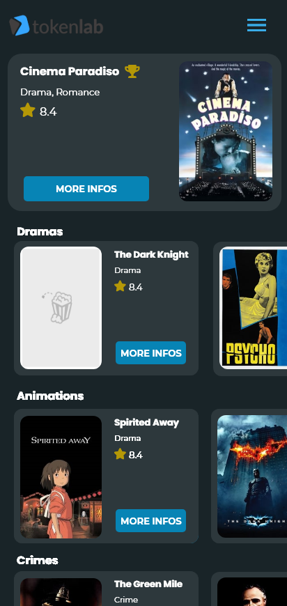
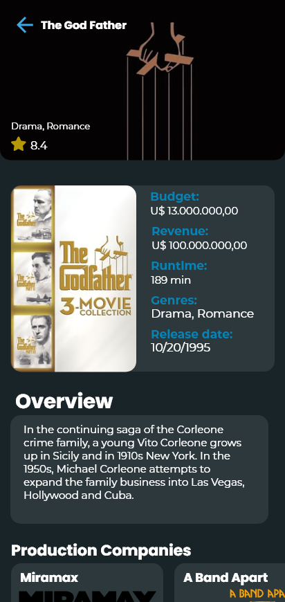
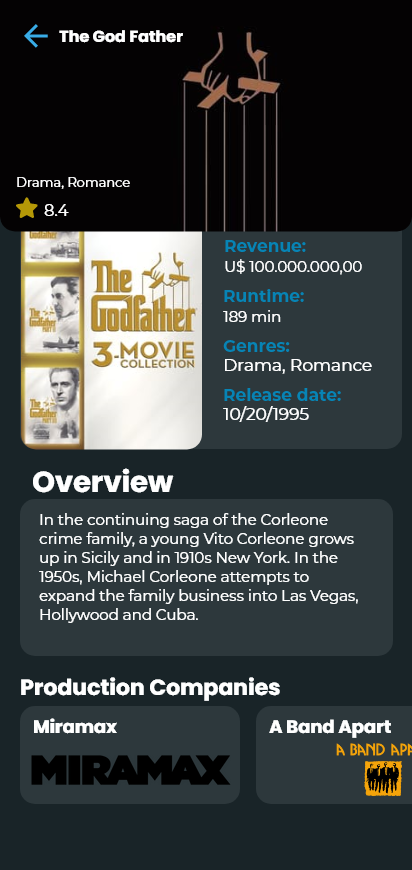
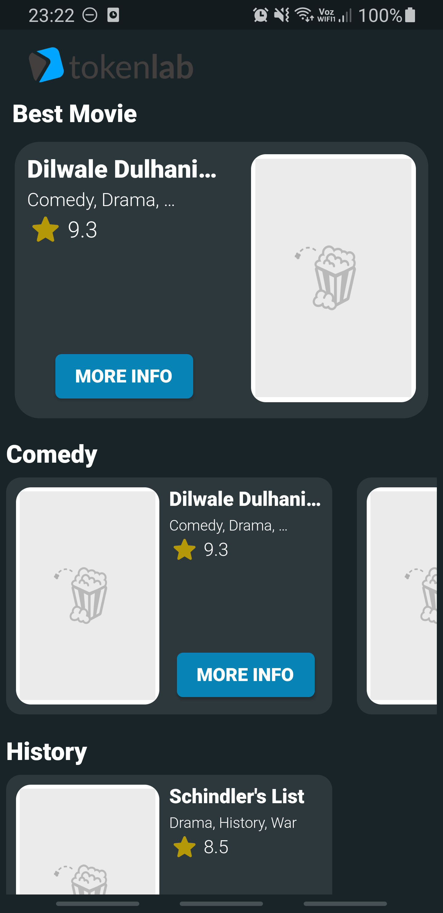
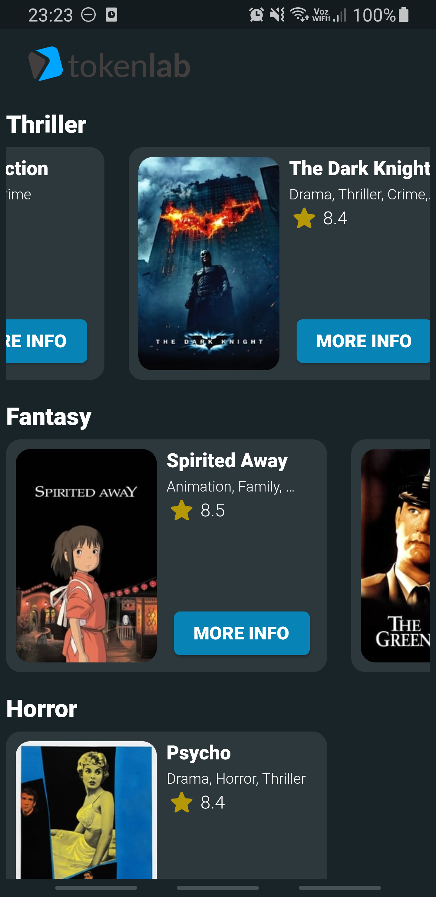
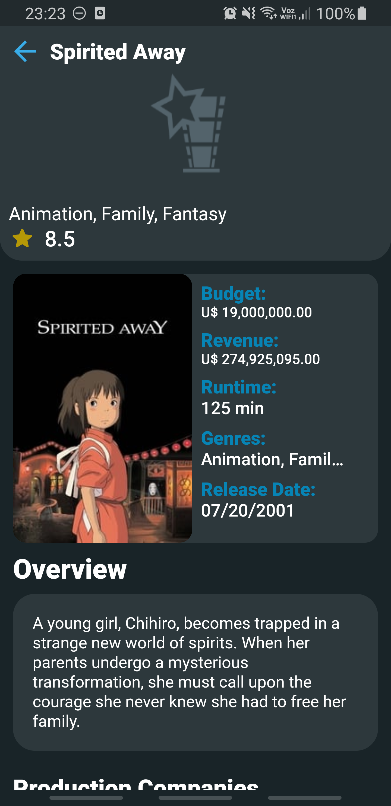
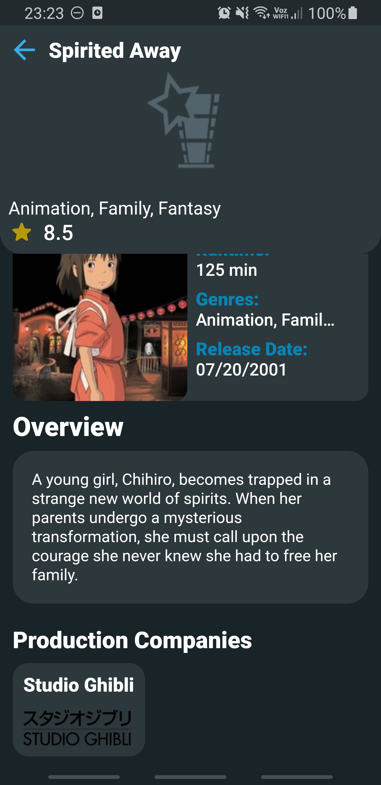

# Tokenlab Movie

## Descrição do projeto
Aplicativo criado com o objetivo de cumprir o desafio proposto no processo seletivo da empresa Tokenlab.

O aplicativo simula uma base de dados online de filmes, onde são listados alguns titulos de relevância no mundo todo. Todos os dados são obtidos por meio de uma requisição HTTP no endpoint https://desafio-mobile.nyc3.digitaloceanspaces.com/movies.

Para o desenvolvimento do projeto, foi tomado como base o padrão arquitetural MVC (Model-View-Controller). 

## Tecnologia utilizada
Essa foi uma aplicação inteiramente desenvolvida com Flutter, tendo em destaque a utilização do Mobx para axiliar na manutenção de estados.

### Kit de desenvolvimento
- Flutter

### Dependências
- HTTP
- Mobx
- Mobx Codegen
- Flutter Mobx
- Build Runner
- Cached Network Image
- Flutter Launcher Icons
- Flutter Spinkit

## **[Link](https://drive.google.com/file/d/1RfS8ilHRpnsGFohzNYnUo5oAupGBN7I8/view?usp=sharing)** para vídeo com demonstração de funcionamento do aplicativo

## Projeto no Adobe XD

## Screenshots

 

### Tela Inicial
 

### Tela de detalhes de filme
 
